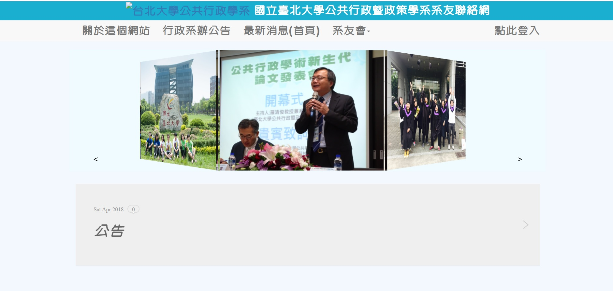
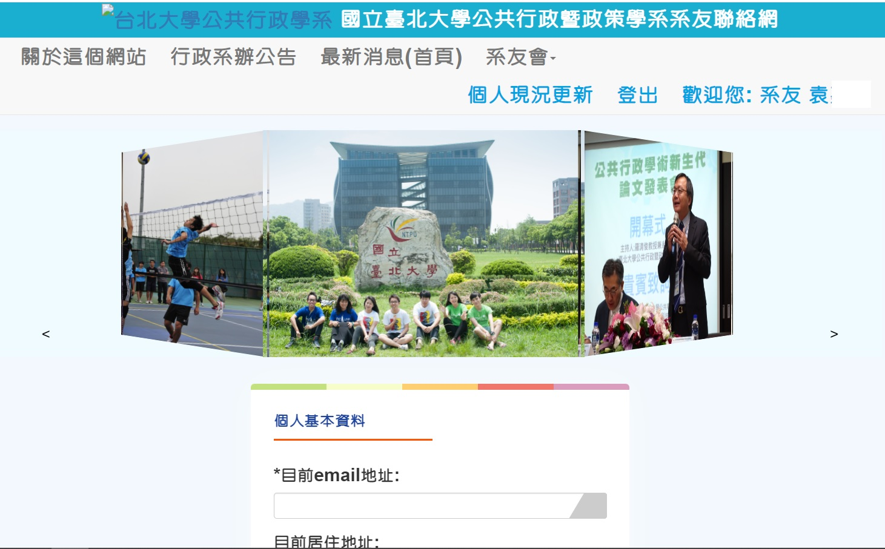

# NTPU_ALUMNI_SYSTEM

---

## Description

A web service for alumni of Department of Public Administration and Policy in NTPU to fill out the form and search for information of alma mater.

 Alumni can login through their ID number , then fill out the form regularly. At the same time, administration can manage website, send email to alumni through one step, get the form data through admin page.

## Framework

Python
Django

Database: SQLite

## Requirements

bs4

numpy

six

pandas

Django<2.0.0,>=1.11.8

restframework==3.9.0

